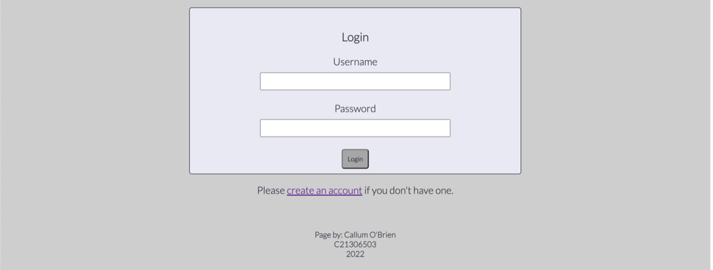
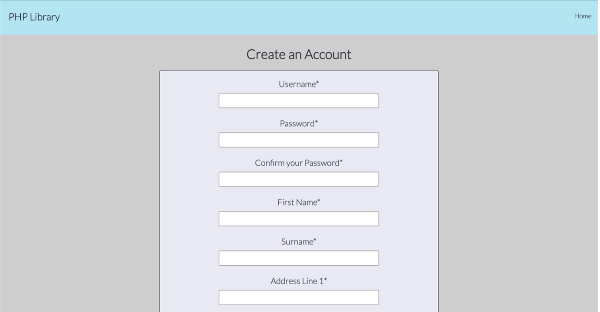
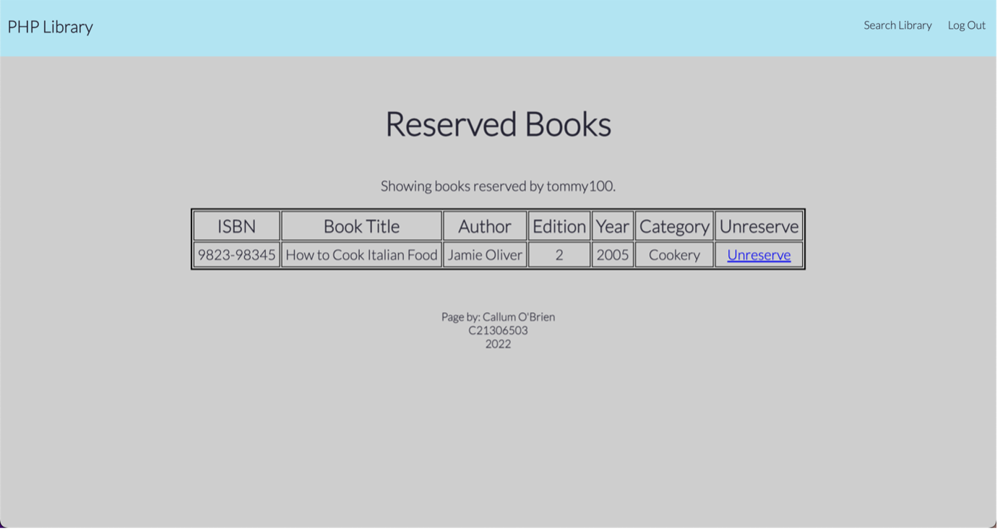
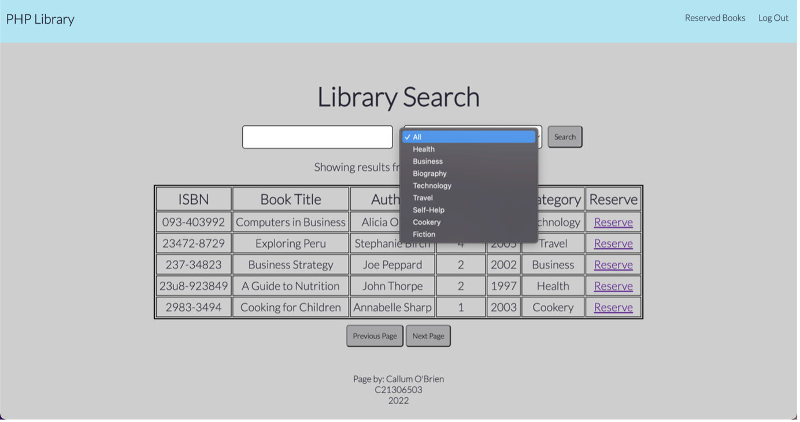

# php-library

A library website written in PHP.
The website features the following pages:
* index.php
	- The homepage of the website
	- Gives a brief description of the site and its functionality
	- Allows the user to log into their account, or create one 

* register.php
	- Allows the user to create an account.
	* Incorporates full error checking, including:
		- Checking for a unique username
		- Ensuring a minimum password length
		- Ensuring both passwords entered match
		- Ensuring the phone number entered is fully numeric
		- Ensuring the phone number is the correct length and is unique 
		- Ensures all required fields have been filled out.
	- All of this is done using PHP validation, and appropriate error messages are displayed to the user.

Both of the following pages require the user to be logged in, and shows appropriate error messages where needed.
* search.php
	- Allows the user to search for a book using name and category
	- Searches through the DB using SQL Queries 
	- Returns a list of books matching the query, displayed 5 rows at a time with 'next' and 'previous' buttons
	- Only shows books that are not reserved
	- Features a 'Reserve' button which adds that book to that user's reserved books

* reserve.php
	- Shows the user a list of their reserved books and allows them to remove the reservations

# Screenshots

## index.php

## register.php

## reserve.php

## search.php

## No Access Error

